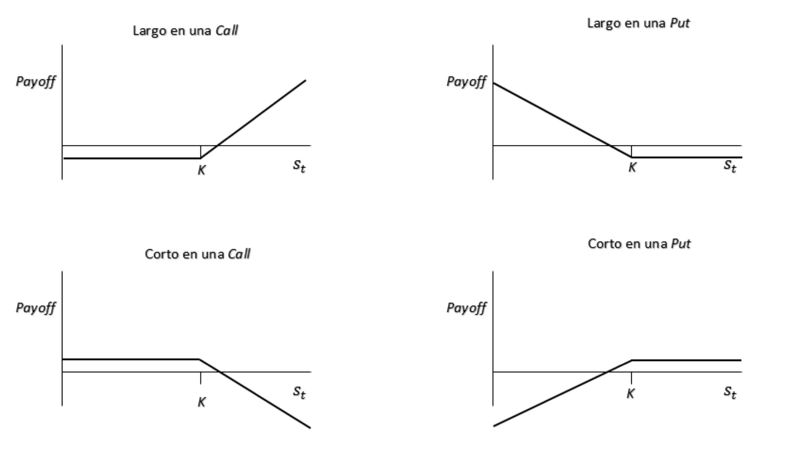

<section class="title-slide">
Semana 2 | Instrumentos de cobertura de riesgos mediante derivados financieros 

Ingeniería Financiera y Administración de Riesgos Financieros • <em>Octubre 14, 2025</em>

</section>

---

## Agenda
1. Sobre la Semana Anterior
2. Contenido Semana 2

---

## Sobre la Semana Anterior
- **Riesgo y Rendimiento**
- **Tipos de Riesgos**
    - *Mercado*
    - *Crédito*
    - *Liquidez*
    - *Operacional*
- **Medidas de Riesgo**

---

## Semana 2
Instrumentos de Cobertura de Riesgos Mediante Derivados Financieros 

---

# Semana 2: Instrumentos de cobertura de riesgos mediante derivados financieros  
- **2.1 Definición de instrumento derivado**
- **2.2 Mercado de opciones**
    - 2.2.1 Características y participantes en el mercado de opciones
    - 2.2.2 Clasificación de las opciones
    - 2.2.3 Representación gráfica y numérica opciones
- **2.3 Mercado de futuros**
- **2.4 Swaps de interés**
- **2.5 Forwards**

---

## 2.1 Definición de instrumento derivado — Conceptos base (1/2)
- Derivado: contrato cuyo **valor depende** de un **subyacente** $S$ (acción, índice, tasa, FX, commodity).
- Elementos: **$S_0$**, **strike $K$**, **vencimiento $T$**, **nocional $N$**, **liquidación** (física/cash).
- Funciones económicas: **cobertura**, **especulación**, **arbitraje**.
- Valoración: principio de **no arbitraje** + réplicas (carteras sintéticas).

--

## 2.1 Definición de instrumento derivado — Conceptos base (2/2)
- **Mercados:**
  - **OTC** (forwards, swaps, opciones exóticas): flexibles, mayor riesgo de contraparte (mitigable con colateral/CSA).
  - **Bolsa** (futuros, muchas opciones): estandarizados, **clearing** y márgenes.
- **Riesgos:** mercado, base, liquidez, contraparte, operacional.
- **Mapa temático semana:** opciones → futuros → swaps → forwards.

---

## 2.2 Mercado de opciones — Introducción
- **Call**: derecho a **comprar** $S$ a $K$. **Put**: derecho a **vender** $S$ a $K$.
- **Estilo**: europea (solo en $T$) vs. americana (en/antes de $T$).
- **Prima**: precio de la opción (valor **intrínseco** + **tiempo**).
- **Moneyness**: ITM / ATM / OTM.
- Drivers del precio: $S_0$, $K$, $T$, $r$, **volatilidad** $\sigma$, dividendos.

--

### 2.2.1 Características y participantes
- **Participantes:**
  - **Hedgers** (reducen exposición), **especuladores** (direccional/volatilidad), **arbitrajistas** (paridades).
  - **Comprador** (largo): paga prima, riesgo acotado; **vendedor** (corto): cobra prima, riesgo potencialmente alto.
- **Microestructura:** mercados listados con **market makers**, libros de órdenes, horquillas.

--

### 2.2.2 Clasificación de las opciones
- Por subyacente: **equity**, **índices**, **FX**, **tasas**, **commodities**.
- Por liquidación: **física** vs **diferencial** (cash-settled).
- Por estilo: **europeas** vs **americanas** (early exercise).
- Por estructura: **vanilla** vs **exóticas** (barrier, asian, digital, etc.).

--

### 2.2.3 Representación gráfica y numérica — Payoffs (1/3)
- **Call larga (europea)** a vencimiento $T$:
$$
\Pi_T^{\text{call long}} = \max(S_T - K, 0) - \text{prima}
$$
- **Break-even:** $S_T^{*} = K + \text{prima}$.
- **Call corta:**
$$
\Pi_T^{\text{call short}} = -\max(S_T - K,0) + \text{prima}
$$

--

### 2.2.3 Representación gráfica y numérica — Payoffs (2/3)
- **Put larga (europea)** a vencimiento $T$:
$$
\Pi_T^{\text{put long}} = \max(K - S_T, 0) - \text{prima}
$$
- **Break-even:** $S_T^{*} = K - \text{prima}$.
- **Put corta:**
$$
\Pi_T^{\text{put short}} = -\max(K - S_T,0) + \text{prima}
$$

--

### 2.2.3 Representación gráfica y numérica — Paridades & ideas (3/3)
- **Paridad put–call (europeas, sin dividendos):**
$$
C - P = S_0 - K e^{-rT}
$$
- Con dividendos conocidos $D$:
$$
C - P = S_0 - D - K e^{-rT}
$$
- **Intuición de “griegas” (narrativa):**  
  - **Delta** $\approx \partial \text{Precio}/\partial S$.  
  - **Vega** $\uparrow$ con $\sigma$.  
  - **Theta**: decaimiento temporal.

--

### 2.2.4 Representación gráfica

<figure>
  
  <figcaption style="margin-top:0.6rem;">
    <small><strong>Referencia:</strong> Muñoz Moreno, Nicolas. <em>Valoración de una opción call con activo subyacente energía</em>, junio 2017. 
    <a href="https://repositorio.uniandes.edu.co/server/api/core/bitstreams/95ac4302-f352-4903-920d-59606fdf5ac3/content">https://repositorio.uniandes.edu.co/server/api/core/bitstreams/95ac4302-f352-4903-920d-59606fdf5ac3/content</a>.
    </small>
  </figcaption>
</figure>

---

## 2.3 Mercado de futuros — Mecánica
- Contratos **estandarizados**, negociación en bolsa (CME/ICE), **cámara de compensación**.
- **Margen inicial** y **de mantenimiento**; **mark-to-market diario**.
- **Ganancia/pérdida diaria** (1 contrato):
$$
\text{P\&L}_t \approx (F_t - F_{t-1}) \times \text{multiplicador}
$$
*(signo según largo/corto).*

--

## 2.3 Mercado de futuros — Precio, base y cobertura
- **Costo de carry (sin dividendos):** $F_0 \approx S_0 e^{rT}$.
- Con carry/dividendos/costos: $F_0 = S_0 e^{(r + c - y)T}$.
- **Base:** $\text{Base}_t = S_t - F_t$ (converge a $0$ en $T$).
- **Riesgo de base** en coberturas reales.
- **Regla práctica de cobertura:**
  - **Largo** futuros para cubrir **alza** en compras futuras.
  - **Corto** futuros para cubrir **baja** en inventarios.

---

## 2.4 Swaps de interés — Idea central
- **IRS “plain-vanilla”**: intercambio de **pata fija** por **pata flotante** (p.ej., SOFR) sobre nocional $N$.
- Motivación: **transformar** perfil de tasas (deuda flotante $\rightarrow$ fija, y viceversa).
- **Equivalencia:** un swap $\approx$ **portafolio de FRAs** (Forward Rate Agreements).

--

## 2.4 Swaps de interés — Tasa fija “par” y valoración (1/2)
- **Tasa fija par** $S_{\text{par}}$: hace que el **valor presente** del swap sea $\approx 0$ al inicio.
- Con factores de descuento $P(0,t_i)$ y **forward rates** $L_i$ (para cada periodo $i$):
$$
S_{\text{par}} = 
\frac{\sum_i P(0,t_i)\, L_i\, \Delta t_i}{\sum_i P(0,t_i)\, \Delta t_i}
$$
- **Valuación posterior:** $\text{VP}(\text{pata fija}) - \text{VP}(\text{pata flotante})$ (ajustado por colateral si aplica).

--

## 2.4 Swaps de interés — Ejemplos y riesgos (2/2)
- **Ejemplo de uso:** empresa con deuda flotante que quiere **fijar** su costo → entra **pagando fijo**.
- **Riesgos:** contraparte (mitigable con colateral), **mismatch** de fechas/base, liquidez si es OTC.
- Extensiones: **basis swaps** (flotante–flotante), amortizantes, extensibles.

---

## 2.5 Forwards — Definición y precio (1/2)
- Contrato **OTC** para **comprar/vender** el subyacente en $T$ a precio pactado $F_0$.
- **Sin MTM:** flujo único al vencimiento → mayor **riesgo de contraparte** vs. futuros.
- **Precio teórico (sin dividendos):**
  - **Compuesto continuo:** $F_0 = S_0 e^{rT}$.
  - **Compuesto discreto:** $F_0 = S_0 (1+r)^T$.
- Con dividendos conocidos $D$: $F_0 = (S_0 - D)\, e^{rT}$.

--

## 2.5 Forwards — FX e intuiciones (2/2)
- **FX forward** (IRP cubierta, continuo):
$$
F_0^{\text{FX}} = S_0 \, e^{(r_d - r_f) T}
$$
donde $r_d$ = tasa doméstica, $r_f$ = tasa extranjera.
- **Comparación con futuros:** forwards flexibles (tamaño/fecha), futuros más líquidos/estandarizados.
- **Aplicaciones:** cobertura de importaciones/exportaciones, cierre de brechas de duración/precio.

---

## Dudas y Preguntas