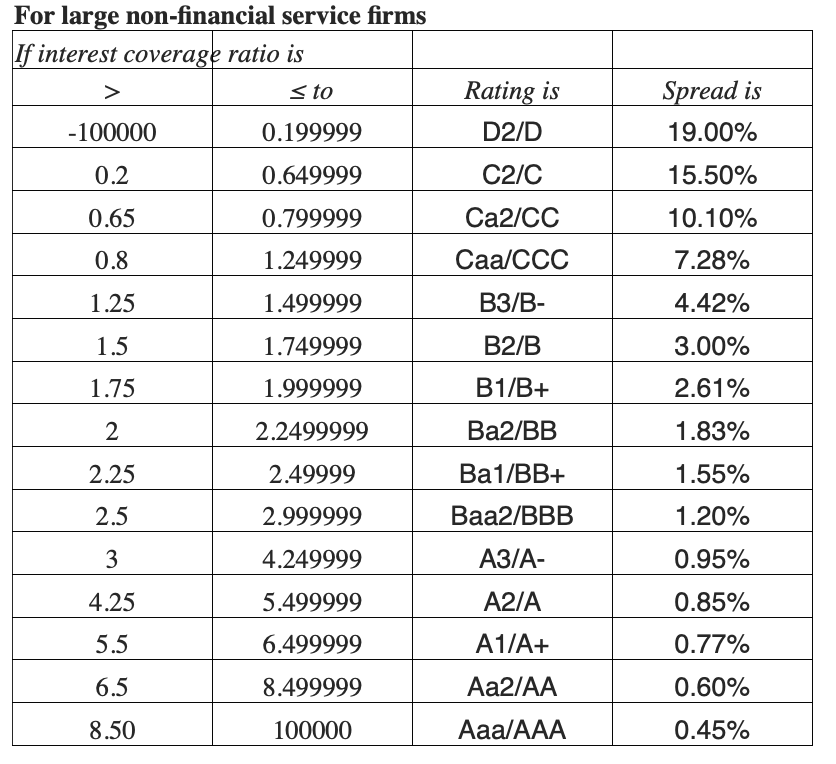
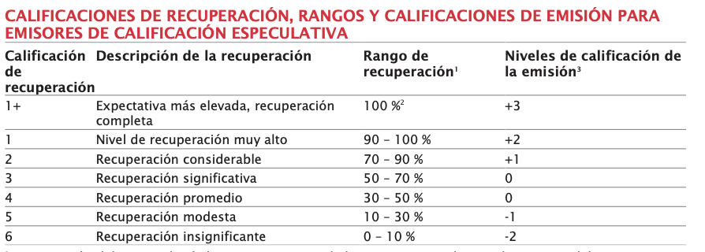

<section class="title-slide">
Semana 3 | Riesgo de Crédito

Ingeniería Financiera y Administración de Riesgos Financieros • <em>Octubre 21, 2025</em>

</section>

---

## Agenda
1. Sobre la Semana Anterior
2. Contenido Semana 3

---

## Sobre la Semana Anterior
- **2.1 Definición de instrumento derivado**
- **2.2 Mercado de opciones**
    - 2.2.1 Características y participantes en el mercado de opciones
    - 2.2.2 Clasificación de las opciones
    - 2.2.3 Representación gráfica y numérica opciones

--

## Sobre la Semana Anterior (Cont.)

- **2.3 Mercado de futuros**
- **2.4 Swaps de interés**
- **2.5 Forwards**

---

## Semana 3

Riesgo de Crédito

---

# Semana 3: 
Riesgo de Crédito

- **3.1 Riesgo de crédito: Elementos Clave**
- **3.2 Medición del riesgo de crédito**
- **3.3 Ratings financieross**
- **3.4 Cobertura de riesgos de crédito mediante instrumentos financieros**

---

## 3.1 Riesgo de crédito: Elementos Clave
- **Pérdida Esperada (Expected Loss, EL)**: $EL = PD \times LGD \times EAD$.
- **Pérdida No Esperada (Unexpected Loss)**: volatilidad alrededor de $ EL $ → **capital económico**.
- Conexiones: **liquidez** (préstamos en mora ↑ → tensión de fondeo) y **tasas de interés** (ajustes de spreads).

--

## Exposición y recuperabilidad
- **Exposición al Incumplimiento (EAD)**: saldo + compromisos no utilizados (ponderados).
- **Severidad de Pérdida (LGD)**: $ LGD = 1 - \text{tasa de recuperación} $; depende de garantías, prioridad de cobro y costos.
- Políticas de **colateral** y **seniority** mejoran recuperabilidad ⇒ reducen **LGD**.

--

## Medición (I): Lectura financiera base
- **Liquidez**: razón corriente, prueba ácida ⇒ colchón de caja.
- **Solvencia/Apalancamiento**: Deuda/**Earnings Before Interest, Taxes, Depreciation and Amortization (EBITDA)**; Deuda/Patrimonio.

--

- **Cobertura**: **Índice de Cobertura de Intereses (ICR)** $=\frac{\text{EBIT}}{\text{Gasto por intereses}}$; Flujo de Caja Libre/Deuda.
- **Rentabilidad/Eficiencia**: **Return on Assets (ROA)**, **Return on Equity (ROE)**, márgenes.

--

## Punto de equilibrio y solidez operativa
- **Punto de Equilibrio**: cubrir **costos fijos** con **margen de contribución**.
- Lectura crediticia: distancia al punto de equilibrio = **colchón** ante shocks.
- “Más allá del punto de equilibrio”: **solidez** = capacidad de sostener servicio de deuda en escenarios de estrés.

--

## Equilibrio financiero y solvencia
- Equilibrio = **operación** (punto de equilibrio) + **finanzas** (servicio de deuda) + **liquidez** (caja y rotación).
- Señales de tensión: caída del margen, quiebre de covenants, alargamiento del ciclo de caja.
- Integración **flujo–balance–estructura** para diagnóstico.

--

## Coberturas financieras: ratios clave
- **Apalancamiento (Deuda/EBITDA)** e **ICR** como palancas del **spread**.
- **Estructura de vencimientos** y costo promedio → sensibilidad a **tasas**.
- **Tasa efectiva** de financiamiento: incorpora comisiones y spread.

---

# 3.2 Medición del riesgo de crédito
- **Probabilidad de Incumplimiento (PD)**: por horizonte, categoría de riesgo y cohorte.
- **Severidad de Pérdida (LGD)**: función de colateral, sector y jurisdicción.
- **Exposición al Incumplimiento (EAD)**: líneas revolventes vs. préstamos a plazo; **utilización** en estrés.

--

## Validación y monitoreo de modelos
- Métricas: **Receiver Operating Characteristic (ROC)**, **Area Under the Curve (AUC)**, estadístico **Kolmogórov–Smirnov (KS)**.
- **Backtesting** y **matrices de transición** por rating/cohorte.
- Estabilidad del modelo: **drift** de variables y performance.

--

## Scoring clásico: análisis discriminante
- Idea: combinar ratios para separar “buenos” y “malos” pagadores en un eje.
- Variables típicas: **liquidez**, **apalancamiento**, **cobertura**, **rentabilidad/eficiencia**.
- Evaluación: **matriz de confusión**, precisión, sensibilidad, especificidad; **umbrales** de decisión.

--

## Distress corporativo: puntuación Z (Altman)
- Fórmula clásica (manufactura):
  

  $$ 
  Z = 1.2\,\frac{\text{Capital de trabajo}}{\text{Activos Totales}} 
  + 1.4\,\frac{\text{Utilidades retenidas}}{\text{Activos Totales}} 
  + 3.3\,\frac{\text{EBIT}}{\text{Activos Totales}}
  $$

  $$
  + 0.6\,\frac{\text{Valor de mercado del patrimonio}}{\text{Pasivo Total}} 
  + 1.0\,\frac{\text{Ventas}}{\text{Activos Totales}}
  $$
  

--

- Uso: señal temprana de **deterioro** y probabilidad de quiebra.
- Limitaciones por **sector/país**; **ZETA®** ajusta especificidad.

--

## Scoring con redes neuronales
- Ventaja: captura **no linealidades** e **interacciones** complejas.
- Riesgos: **sobreajuste** → necesidad de validación cruzada y regularización.
- Métricas: **ROC/AUC**, lift, **KS**; análisis de sensibilidad de variables.

--

## Comparativas de algoritmos (estado del arte)
- Modelos: árboles de decisión, máquinas de vectores de soporte, redes neuronales, **ensembles**, regresión logística, análisis discriminante.
- Implicación clave: **gobernanza de modelos** y validación rigurosa > “modelo milagro”.

---

# 3.3 Ratings financieros
- Evaluación externa del **riesgo del emisor** (salvo ratings específicos de instrumento).
- Mapa **rating → spread**: peor rating ⇒ mayor **prima de riesgo**.
- Limitaciones: horizonte, discrecionalidad, cambios discretos y rezagos.

--

## Criterios de calificación
- Dimensiones típicas: **posición de negocio**, **perfil financiero**, **apalancamiento**, **coberturas**, **liquidez**, **gobierno corporativo**.
- Indicadores que pesan: **Índice de Cobertura de Intereses (ICR)**, Deuda/EBITDA, Flujo de Caja Libre/Deuda.
- **Matriz de categorías** y umbrales cualitativos: coherencia entre métrica y narrativa.

--

## Spreads y prima de riesgo de crédito
- Intuición: spread = riesgo idiosincrático del emisor + condiciones de mercado (liquidez y tasa base).
- Más apalancamiento y menor cobertura ⇒ spread mayor.
- En pricing: ajuste de tasa según **Pérdida Esperada (EL)** y **capital** requerido.

--

  

    
  

  

    
  

  

    
  

--

  

    
  

  

    
  

  

    
  

--

# 3.4 Cobertura de riesgos de crédito
### Visión integrada: estructura y coberturas

--

- Vínculos: **apalancamiento–cobertura–rating–spread** (círculo virtuoso/vicioso).
- Palancas del CFO: reducir deuda cara, alargar **vencimientos**, elevar **Índice de Cobertura de Intereses (ICR)**.
- Señal a mercado: métricas sólidas ⇒ **costo de fondeo** más bajo.

--

## Cobertura a nivel empresa (crédito)
- **Colateral/garantías** (disminuyen **Severidad de Pérdida, LGD**).
- **Covenants** (disciplina de apalancamiento, cobertura y liquidez).
- **Seguros de crédito** (transferencia parcial del riesgo); políticas de **provisiones**.

--

## Gestión de vencimientos y liquidez
- Perfil de **vencimientos** y **amortizaciones**: reduce presión de liquidez → menor **Probabilidad de Incumplimiento (PD)**.
- Buffers de caja y líneas comprometidas: protegen **Exposición al Incumplimiento (EAD)**.
- Sensibilidad del **Índice de Cobertura de Intereses (ICR)** a shocks de tasa y de **EBITDA**.

--

## Cierre operativo
- Checklist:$ EL=PD\times LGD\times EAD $, lectura de puntuación Z, métricas de cobertura (ICR, Deuda/EBITDA), coherencia rating–spread.
- Priorización: **mejorar cobertura y liquidez**, **ajustar apalancamiento**, **alinear vencimientos**.
- Entorno y gobernanza: monitoreo de métricas, backtesting y revisión de modelos.

---

## Dudas y Preguntas