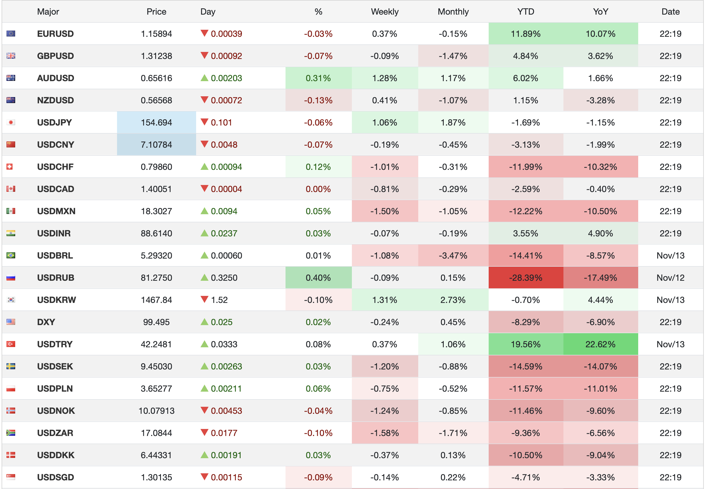
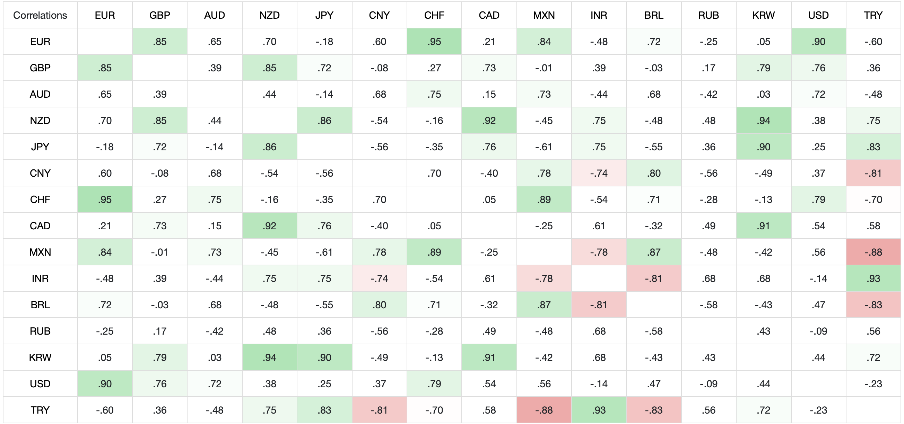
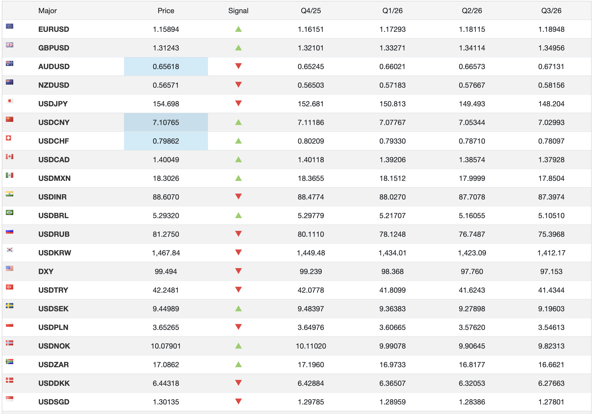

<section class="title-slide">
Semana 6 | Riesgo de Mercado (Cont.)

Ingeniería Financiera y Administración de Riesgos Financieros • <em>Noviembre 11, 2025</em>

</section>

---

## Agenda
1. Sobre la Semana Anterior
2. Contenido Semana 6

---

## Sobre la Semana Anterior
- **5.1 Fundamentos de medición**
- **5.2 Duración efectiva y curva de tasas**
- **5.3 Cobertura con futuros y swaps**
- **5.4 Puente a ALM y ejemplos**

---

## Semana 6

Riesgo de Mercado (Cont.)

--

# Semana 6: 
Riesgo Mercado (Cont.)

- **6.1 Medición de la exposición cambiaria**
- **6.2 Paridad cubierta y precios a término**
- **6.3 Coberturas**
- **6.4 Oeprativa, riesgos y contabilidad**

---
<!-- .slide: data-background-color="transparent" -->
## 6.1.1 Medición de la exposición cambiaria — Taxonomía
- Tres formas de exposición:
  - **Transacción (TX)**: flujos contractuales en moneda extranjera con monto y fecha.
  - **Traducción (TRAD)**: conversión contable de estados financieros a moneda de reporte.

--

  - **Económica (ECO)**: sensibilidad de ventas, costos o márgenes al tipo de cambio.
- Tipo de cambio: $x_t$ (precio de 1 unidad de moneda extranjera en moneda doméstica).

--
<!-- .slide: data-background-color="transparent" -->
## 6.1.2 Medición de la exposición cambiaria — TX
- Construir **calendario de flujos** por moneda: $(T_i, Q_i, \text{signo})$.
- Exposición de transacción neta a $T$: suma de nocionales equivalentes en moneda de reporte.
- Valor doméstico de un cobro $Q$ en $T$: $Q \cdot x_T$.
- Decisión de cobertura basada en nocional, horizonte y distribución temporal.

--
<!-- .slide: data-background-color="transparent" -->
## 6.1.3 Medición de la exposición cambiaria — TRAD
- Activos/pasivos monetarios a **tipo de cambio de cierre**; ingresos/gastos a tipos promedio (según política).
- Impacto en métricas y **covenants** (p. ej., deuda/EBITDA) aun sin flujo de caja.
- Medición: reexpresar estados bajo escenarios alternativos de tipo de cambio de cierre.

--
<!-- .slide: data-background-color="transparent" -->
## 6.1.4 Medición de la exposición cambiaria — ECO
- Estimar **beta cambiaria** de márgenes/EBITDA vía regresión:
  - $\Delta \ln(\text{Margen}) = \alpha + \beta\,\Delta \ln(x_t) + \Gamma\mathbf{Z}_t + \varepsilon_t$.
- Usar $\beta$ para traducir escenarios de $x_t$ a variaciones esperadas de resultado.
- Coberturas parciales orientadas a estabilizar márgenes (no necesariamente nocional pleno).

--
<!-- .slide: data-background-color="transparent" -->
## 6.1.5 Medición de la exposición cambiaria — P&L sin cobertura
- Exportador con cobro $Q$ en $T$: valor doméstico $Q\,x_T$.
- **P&L no cubierto** relativo a spot $x_0$: $Q\,(x_T - x_0)$.
- Riesgo central: variabilidad de $x_T$ vs. planificación de caja y márgenes.

---
<!-- .slide: data-background-color="transparent" -->
## 6.2.1 Paridad cubierta y precios a término — Notación
- **Spot** actual: $x_0$.
- **Forward** a $T$: $F_{0,T}$.
- Tasas: $r_d$ (doméstica) y $r_f$ (extranjera), composición continua salvo indicación.
- Objetivo: derivar precio forward teórico (**no arbitraje**) y leer **puntos forward**.

--
<!-- .slide: data-background-color="transparent" -->
## 6.2.2 Paridad cubierta de intereses (CIP) — Fórmula base
- **CIP** (*Covered Interest Parity*): igualdad de retornos con cobertura a término.
- Con composición continua:
  $$
  F_{0,T} = x_0\ e^{(r_d - r_f)T}.
  $$

--

- Con interés simple:
  $$
  F_{0,T} = x_0\ \frac{1 + r_d T}{1 + r_f T}.
  $$
- Impide **arbitraje cubierto** entre monedas.

--
<!-- .slide: data-background-color="transparent" -->
## 6.2.3 Forward points y pips (definidos aquí)
- **Puntos forward**: $F_{0,T} - x_0$.
- **Pip** (*percentage in point*): paso mínimo típico; para pares mayoritarios 1 pip = $10^{-4}$.
- Lectura económica: puntos forward reflejan diferencial de tasas $r_d - r_f$ ⇒ **descuento/prima** a término.

--
<!-- .slide: data-background-color="transparent" -->
## 6.2.4 Réplica de CIP — Intuición
- Estrategia A: invertir 1 en doméstica a $r_d$.
- Estrategia B: convertir a extranjera a $x_0$, invertir a $r_f$, y cubrir con forward a $F_{0,T}$.
- Igualdad de retornos en $T4 ⇒ exige $F_{0,T}$ de CIP; si no, **arbitraje**.

---
<!-- .slide: data-background-color="transparent" -->
## 6.2.5 Ejemplo numérico — Cálculo de $F_{0,T}$ y puntos
- Datos: $x_0=1.1000$, $T=0.5$ años, $r_d=3\%$, $r_f=1\%$, comp. continua.
- Cálculo:
  $$
  F_{0,T} = 1.1000 \times e^{(0.03 - 0.01)\cdot 0.5}
          \approx 1.1000 \times e^{0.01}
  $$
  $$
          \approx 1.1111.
  $$
- Puntos forward = $+0.0111$ = **111 pips** ⇒ prima a término.

--

<!-- .slide: data-background-color="transparent" -->
## 6.2.6 P&L con forward — Cobertura directa
- Vender a término $Q$ unidades extranjeras a $F_{0,T}$ fija la conversión.
- **P&L cubierto** relativo a $x_0$:
  $$
  Q(F_{0,T} - x_0).
  $$
- Independiente de $x_T$: elimina incertidumbre de precio de conversión.

--

<!-- .slide: data-background-color="transparent" -->
## 6.2.7 Rollover y costo de carry
- **Rollover**: cerrar forward próximo a vencimiento y abrir uno nuevo más adelante.
- **Carry**: secuencia de puntos forward intertemporales (función de $r_d - r_f$).
- Plan de roll adecuado evita quedar **descubierto** si el calendario real se retrasa.

---
<!-- .slide: data-background-color="transparent" -->
## 6.3.1 Coberturas — Forwards vs. futuros (definidos aquí)
- **Forward (OTC)**: *Over-The-Counter*, bilateral, sin liquidación diaria; ajuste fino de nocional; riesgo de contraparte.
- **Futuro**: estandarizado, cámara de compensación, **MTM** (*Mark-To-Market*, liquidación diaria) y **márgenes** (inicial/variación).
- Trade-off: forwards (flexibilidad/ajuste) vs. futuros (menor riesgo de contraparte, pero flujos diarios y posible **tracking error**).

--
<!-- .slide: data-background-color="transparent" -->
## 6.3.2 Medición del tracking error (definido aquí)
- **Tracking error**: variabilidad del resultado de la cobertura vs. la exposición “ideal”.
- Fuentes: base contrato/spot, estandarización de vencimientos, MTM y liquidez.
- Medición: comparar series de $\Delta x_t$ del flujo con $\Delta$ del contrato elegido.

--
<!-- .slide: data-background-color="transparent" -->
## 6.3.3 Cross-hedging (cobertura cruzada) y riesgo de base
- Si no existe contrato líquido para la moneda objetivo, usar una **moneda proxy** correlacionada.
- **Riesgo de base**: divergencia entre desempeño del proxy y el del tipo objetivo.
- Efectividad depende de **correlación** y su estabilidad en el tiempo.

--
<!-- .slide: data-background-color="transparent" -->
## 6.3.4 Ratio de cobertura óptimo — Regresión
- Minimiza la varianza del resultado cubierto.
- Estimador por regresión:
  $$
  h^\* = \beta
      = \frac{\operatorname{Cov}(\Delta S,\ \Delta H)}{\operatorname{Var}(\Delta H)},
  $$
  donde $\Delta S$ = cambio del tipo objetivo, $\Delta H$ = cambio del instrumento.

--
- **Reducción de varianza** esperada:
  $$
  \operatorname{Var}_{\text{hedged}} = \operatorname{Var}(\Delta S)\,(1 - \rho^2),
  $$
  con $\rho$ = correlación entre $\Delta S$ y $\Delta H$.

--
<!-- .slide: data-background-color="transparent" -->
## 6.3.5 Ejemplo — Cross-hedging con proxy
- Objetivo: cubrir COP/USD sin contrato líquido; proxy: BRL/USD.
- Estimar $\beta$ de $\Delta$ COP/USD sobre $\Delta$ BRL/USD.
- Nocional del hedge = $\beta \times$ exposición en COP; riesgo residual = parte idiosincrática de COP/USD.

--

<!-- .slide: data-background-color="transparent" -->
## 6.3.6 Layered hedging (por capas)
- Flujos extendidos/fechas inciertas ⇒ fraccionar nocional en **capas** (p. ej., 40% a 3m, 30% a 6m, 30% a 9m).
- Suaviza impacto de errores de calendario y reduce dependencia de un único vencimiento.
- Mayor complejidad operativa y de monitoreo.

--
<!-- .slide: data-background-color="transparent" -->
## 6.3.7 Forwards no entregables (NDF) — Definición
- **NDF** (*Non-Deliverable Forward*): liquidación por diferencias en moneda “dura” (p. ej., USD).
- Al vencimiento: comparar **fixing** oficial vs. precio pactado; liquidar diferencia \(\times\) nocional.
- Útil en monedas con **controles** o poca convertibilidad.

---

<!-- .slide: data-background-color="transparent" -->
## 6.4.1 Operativa, riesgos y contabilidad — VaR/ES residual
- Aplicar **VaR** (*Value at Risk*) y **ES** (*Expected Shortfall*) a la **exposición residual** post-hedge.
- $VaR_\alpha$: pérdida mínima en el $\alpha$% peor; $ES_\alpha$: promedio de pérdidas en ese conjunto.
- Simular escenarios de $x_T$ y del instrumento ⇒ distribución del **P&L neto** y verificación de límites.

--

<!-- .slide: data-background-color="transparent" -->
## 6.4.2 Operativa, riesgos y contabilidad — Efectividad
- **Contabilidad de coberturas**: requiere documentación, designación y pruebas de **efectividad**.
- Efectividad: comovimiento entre el elemento cubierto y el instrumento (ex-ante y ex-post).
- Políticas internas para TRAD a fin de moderar volatilidad contable.

--

<!-- .slide: data-background-color="transparent" -->
## 6.4.3 Operativa, riesgos y contabilidad — Contraparte y liquidación
- **OTC**: riesgo de contraparte mitigable con **CSA** (*Credit Support Annex*, acuerdos de colateral).
- Riesgo de liquidación (**Herstatt**): pagos en distintas monedas no sincronizados.
- **CLS** (*Continuous Linked Settlement*): liquidación **PvP** (*payment-versus-payment*) para reducir riesgo.

--

<!-- .slide: data-background-color="transparent" -->
## 6.4.4 Swaps de divisas y CCS (definidos aquí)
- **Swap de divisas**: intercambio de principal e intereses en dos monedas.
- **CCS** (*Cross-Currency Swap*): piernas fija/flotante en cada moneda; puede incluir **re-exchange** del principal al vencimiento.
- Útil para cubrir simultáneamente **tasa y divisa**, alineando flujos con moneda funcional.

--

<!-- .slide: data-background-color="transparent" -->
## 6.4.5 Diseño de cobertura con forward — Procedimiento
- Identificar TX/TRAD/ECO y calendario de flujos.
- Calcular $F_{0,T}$ con CIP; leer **puntos forward**.
- Elegir nocional $Q$ y vencimiento $T$; plan de **rollover**.
- Estimar resultado esperado: $Q\,(F_{0,T} - x_0)$ y métricas de **VaR/ES** residual.

--

<!-- .slide: data-background-color="transparent" -->
## 6.4.6 Comparativa — Forward vs. Futuro vs. NDF vs. CCS
- **Forward (OTC)**: ajuste fino, sin MTM; contraparte/CSA.
- **Futuro**: MTM y márgenes; menor contraparte; potencial **tracking error**.
- **NDF**: liquidación por diferencias; útil en mercados con controles.
- **CCS**: casar tasa y divisa; mayor complejidad, pero cobertura integral.

--

<!-- .slide: data-background-color="transparent" -->
## 6.4.7 Caso integrado — Exportador 6m y 12m
- Cobros $Q_1$ (6m) y $Q_2$ (12m); spot $x_0$; tasas $r_d, r_f$.
- Forwards teóricos:
  $$
  F_{0,0.5} = x_0 e^{(r_d - r_f)0.5}, \quad
  F_{0,1}   = x_0 e^{(r_d - r_f)1}.
  $$

--

- Plan **por capas**: fijar hoy forwards por $Q_1$ (6m) y $Q_2$ (12m).
- Incertidumbre en $Q_2$: cubrir con $h^\* < 1$ (regresión) y monitoreo de **tracking error**.

--

<!-- .slide: data-background-color="transparent" -->
## 6.4.8 Resumen operativo — Checklist de implementación
- Medir TX/TRAD/ECO y cuantificar $\beta$ cuando aplique.
- Calibrar $F_{0,T}$, puntos forward y plan de **roll**.
- Seleccionar instrumento (forward/futuro/NDF/CCS) y dimensionar con $h^\*$ si procede.
- Simular P&L neto; establecer límites con **VaR/ES** y pruebas de efectividad.

---

## Dudas y Preguntas

---

## Soluciones

--

### 6.3.5 Cross-hedging con proxy (COP/USD $\to$ BRL/USD)

**Objetivo.** Cubrir $S_t=\Delta\ln(\mathrm{COP}/\mathrm{USD})$ con proxy $H_t=\Delta\ln(\mathrm{BRL}/\mathrm{USD})$.

**Ratio óptimo (mínima varianza).**
$$
h^\*=\beta=\frac{\operatorname{Cov}(\Delta S,\Delta H)}{\operatorname{Var}(\Delta H)}
$$
$$
\rho=\frac{\operatorname{Cov}(\Delta S,\Delta H)}{\sigma_S\,\sigma_H}.
$$

--

**Supuestos (ilustrativos, consistentes).** Frecuencia semanal, 3 años:
- $\sigma_S=2.00\%=0.02$, $\ \sigma_H=1.80\%=0.018$, $\ \rho=0.90$.
- Varianzas: 
   1. $\operatorname{Var}(\Delta S)=0.0004$, 
   2. $\ \operatorname{Var}(\Delta H)=0.000324$.

--

- Covarianza:
$$
\operatorname{Cov}(\Delta S,\Delta H)=\rho\,\sigma_S\,\sigma_H
=0.90\times 0.02\times 0.018
$$

=0.000324

--

**Resultado.**
$$
\beta=\frac{0.000324}{0.000324}=\mathbf{1.00},\qquad
\frac{\operatorname{Var}_\text{hedged}}{\operatorname{Var}(\Delta S)}=1-\rho^2
$$

$$
=1-0.81=\mathbf{0.19}.
$$

> Cubre ≈ **81%** de la varianza de la exposición.

--

**Tamaño del hedge (nocional).** Exposición $E=\$10,000,000$ (USD):
$$
N_{\text{proxy}} \approx \beta \times E = 1.00 \times 10{,}000{,}000
$$

$$
= \mathbf{USD\ 10{,}000{,}000}
$$

**Signo/dirección.** Exportador **largo USD** (beneficia si sube COP/USD). Con $\rho>0$ y $\beta>0$, para reducir varianza toma **corto BRL/USD** por $N_{\text{proxy}}$.

--

**Riesgo residual (tracking error).**
$$
\sigma_{\text{res}}=\sigma_S\sqrt{1-\rho^2}=0.02\sqrt{0.19}\approx \mathbf{0.00872}
$$

$$
(0.872\% \text{ semanal})
$$

--

### 6.4.7 Caso integrado — Exportador con cobros a 6m y 12m

**Datos.** Spot hoy $x_0=1.1000$ (dom/FX), tasas cont. $r_d=3\%$, $r_f=1\%$.  
Cobros: $Q_1=2{,}000{,}000$ a $T_1=0.5$; $Q_2=3{,}000{,}000$ a $T_2=1$.  
Para $Q_2$ hay incertidumbre de monto $\Rightarrow$ se usa $h^\*<1$.

--

**CIP (composición continua).**
$$
F_{0,T}=x_0\,e^{(r_d-r_f)T}.
$$

--

**Forwards teóricos.**
$$
F_{0,0.5}=1.1000\,e^{(0.03-0.01)\cdot 0.5}=1.1000\,e^{0.01}\approx \mathbf{1.1111}
\quad(\text{+}111\ \text{pips}),
$$
$$
F_{0,1}=1.1000\,e^{(0.03-0.01)\cdot 1}=1.1000\,e^{0.02}\approx \mathbf{1.1221}
\quad(\text{+}221\ \text{pips}).
$$

--

**Estrategia (capas + cobertura parcial).**
- 6m: cubrir **100%** de $Q_1$ a $F_{0,0.5}$.
- 12m: por incertidumbre, cubrir $h^\*=0.80$ de $Q_2$ y dejar 20% abierto:

$$
Q_{2,\text{cub}}=0.80\times 3{,}000{,}000=\mathbf{2{,}400{,}000}
$$

$$
Q_{2,\text{abierto}}=\mathbf{600{,}000}
$$

--

**P\&L relativo a $x_0$ (forward plain vanilla / NDF).**

--

$$
   \text{P\&L}_{fwd}=Q(F_{0,T}-x_0) 
$$

$$
   \text{(independiente de }x_T\text{)}.
$$

--

**Monto bloqueado hoy.**

$$
\text{P\&L}_{6m}=2{,}000{,}000\,(1.1111-1.1000)=\mathbf{22{,}222},
$$

$$
\text{P\&L}_{12m,\text{cub}}=2{,}400{,}000\,(1.1221-1.1000)=\mathbf{52{,}999},
$$

$$
\text{P\&L}_{\text{bloqueado}}=\mathbf{22{,}222+52{,}999=75{,}221}.
$$

--

**Tramo abierto (20% de $Q_2$).**
$$
\text{P\&L}_{12m,\text{abierto}}=600{,}000\,(x_1-x_0).
$$

--

**Escenario A (apreciación doméstica).** $x_{0.5}=1.09$, $x_1=1.09$.
- Unhedged: $2{,}000{,}000(-0.01)+3{,}000{,}000(-0.01)$
   $=\mathbf{-50{,}000}$.
- Hedged: $75{,}221+600{,}000(-0.01)=\mathbf{69{,}221}$.

--

**Escenario B (depreciación doméstica).** $x_{0.5}=1.15$, $x_1=1.20$.
- Unhedged: $2{,}000{,}000(0.05)+3{,}000{,}000(0.10)=\mathbf{+400{,}000}$.
- Hedged: $75{,}221+600{,}000(0.10)=\mathbf{135{,}221}$.

--

> El hedge **suaviza** resultados: limita pérdidas severas y recorta ganancias extremas. El núcleo del resultado cubierto es el P\&L **bloqueado** por CIP; el tramo abierto mantiene algo de direccionalidad.

--

**Riesgo residual (tramo abierto).** Si $\sigma_{x_1}=0.05$:

$$
   \sigma\!\left[\text{P\&L}_{12m,\text{abierto}}\right]
$$

--

$$
   =Q_{2,\text{abierto}}\ \sigma_{x_1}
$$

--

$$
   =600{,}000\times 0.05
$$

--

$$
   =\mathbf{30{,}000}.
$$

Esto permite construir $VaR/ES$ del remanente si se requiere.

---

# Ejercicio de Divisas

--

## Mapa de mercado – precios y variaciones

<section data-background-color="transparent">
  
</section>

--

## Correlaciones entre divisas

<section data-background-color="transparent">
  
</section>

--

## Proyecciones y forwards implícitos

<section data-background-color="transparent">
  
</section>

---

**Contexto**

Una empresa mexicana exportadora de autopartes factura en dólares estadounidenses (USD) pero reporta sus estados financieros en pesos mexicanos (MXN). Para los próximos 6–9 meses espera cobrar **USD 10 millones**.

La empresa está **larga USD / corta MXN** (si el peso se aprecia, el tipo de cambio USD/MXN baja y la empresa recibe menos MXN por sus USD).

--

El mercado tiene derivados líquidos sobre **USDBRL** (dólar vs real brasileño), pero la liquidez en derivados de **USDMXN** es limitada, por lo que se evalúa una **cobertura cruzada (cross-hedging)**.

A partir de información de mercado se observa:

--

## Datos del ejercicio

### 1. Resumen de mercado (spot y variación semanal)

| Par        | Spot actual | Variación semanal aproximada |
|------------|------------:|-----------------------------:|
| **USDMXN** | 18.3027     | -1.50%                       |
| **USDBRL** | 5.2932      | -1.08%                       |

--

> Para efectos de este ejercicio, suponga que la columna **Weekly** de la tabla es una buena aproximación de la **volatilidad semanal ($\sigma$)** de los retornos $\Delta \ln(\text{tipo de cambio})$. Use el valor absoluto de estos porcentajes.

--

## Datos del ejercicio

### 2. Correlaciones entre retornos semanales

Un gestor de riesgos ha estimado la matriz de correlaciones entre los retornos semanales de los tipos de cambio frente al USD. Un extracto relevante es:

- $\rho(\Delta\text{USDMXN},\ \Delta\text{USDBRL}) = 0.87$.

--

## Datos del ejercicio

### 3. Proyecciones de tipo de cambio (consenso de analistas)

Del cuadro de proyecciones se obtienen los siguientes valores para el cierre de **Q2 2026**:

| Par        | Spot actual | Proyección Q2 2026 |
|------------|------------:|-------------------:|
| **USDMXN** | 18.3027     | 17.9999            |
| **USDBRL** | 5.2932      | 5.16055            |

--

## Requerimientos

1. **Volatilidades semanales y anualizadas**

   a) Interprete las variaciones semanales como volatilidades:
   $$
   \sigma_{\text{MXN, week}} = 1.50\%, \qquad
   \sigma_{\text{BRL, week}} = 1.08\%.
   $$

--

   b) Calcule las **volatilidades anualizadas** de USDMXN y USDBRL, usando 52 semanas por año:
   $$
   \sigma_\text{annual} = \sigma_\text{week} \sqrt{52}.
   $$

--

## Requerimientos

2. **Cálculo del beta de cobertura óptima (mínima varianza)**

   Usando la correlación dada, calcule el **ratio de cobertura óptimo** $h^\*$ para cubrir movimientos de USDMXN usando USDBRL:

   $$
   h^\* = \beta
        = \rho\,\frac{\sigma_{\text{MXN}}}{\sigma_{\text{BRL}}}.
   $$

--

   a) Calcule $h^\*$.  
   b) Interprete el resultado: ¿es mayor o menor que 1? ¿Qué implica eso sobre el tamaño del hedge en BRL respecto a la exposición en MXN?

--

## Requerimientos

3. **Dimensionamiento del nocional de cobertura**

   Suponga que la empresa tiene una exposición de **USD 10 millones** ligada a USDMXN.

   a) Calcule el **nocional óptimo** de cobertura en USDBRL (en USD):

   $$
   N_\text{BRL} = h^\* \times \text{USD }10{,}000{,}000.
   $$

--

   b) Desde el punto de vista de la empresa (larga USD frente a MXN), ¿la posición en USDBRL debe ser **corta** o **larga**? Explique en una frase usando la lógica de las slides (exportador largo USD).

--

## Requerimientos

4. **Reducción de riesgo (tracking error)**

   La desviación estándar semanal del P\&L (en MXN) de la exposición no cubierta es aproximadamente:

   $$
   \sigma_{\text{P\&L, unhedged}} = E \times \sigma_{\text{MXN, week}},
   $$
   donde $E = \text{USD }10{,}000{,}000$.

--

   Para un hedge con ratio óptimo, la varianza residual es:

$$
   \operatorname{Var}_{\text{hedged}}
     = \operatorname{Var}(\Delta S)\,(1-\rho^2).
$$

--

   a) Calcule la **desviación estándar semanal** del P\&L sin cobertura.  
   b) Calcule la desviación estándar semanal del P\&L **cubierto** usando:
$$
   \sigma_{\text{P\&L, hedged}} = E\,\sigma_{\text{MXN, week}} \sqrt{1-\rho^2}.
$$
   c) Anualice ambas desviaciones estándar (sin y con hedge).  
   d) ¿Qué porcentaje de la varianza del riesgo cambiario se logra reducir al usar el proxy BRL? Relacione su respuesta con el $\rho^2$ de la correlación.

--

## Requerimientos

5. **Escenario de proyección y efecto de la cobertura**

   Utilice las proyecciones de Q2 2026:

   $$
   S_0 = 18.3027,\quad S_{Q2} = 17.9999
   $$
   $$
   H_0 = 5.2932,\quad H_{Q2} = 5.16055.
   $$

--

   a) Calcule los **retornos esperados** (en términos de tipo de cambio) desde hoy hasta Q2 2026:

$$
   r_S = \frac{S_{Q2}}{S_0} - 1, \qquad
   r_H = \frac{H_{Q2}}{H_0} - 1.
$$

   b) Suponga que la empresa **no se cubre**. Calcule el cambio esperado en el valor de la cuenta por cobrar (USD 10M) medido en “unidades de retorno” $r_S$.

--

## Requerimientos

   c) Suponga ahora que la empresa aplica el hedge óptimo con ratio $h^\*$ calculado en (2) y toma una posición de tamaño $N_\text{BRL}$ en USDBRL. Calcule el **retorno combinado**:

$$
   r_{\text{hedged}} = r_S - h^\*\,r_H.
$$

--

   d) Compare el resultado esperado sin cobertura y con cobertura:
   - ¿Cuál es el signo del retorno esperado de la posición cubierta?  
   - ¿Qué nos dice eso sobre la interacción entre el hedge (BRL) y la expectativa de mercado?

--

## Guía de solución

*(Números aproximados, redondeados.)*

1. **Volatilidades**

   - $\sigma_{\text{MXN, week}} = 1.50\% = 0.015$  
   - $\sigma_{\text{BRL, week}} = 1.08\% \approx 0.0108$

--

   Anualizadas:

   - $\sigma_{\text{MXN, ann}} = 0.015\sqrt{52} \approx 10.8\%$  
   - $\sigma_{\text{BRL, ann}} = 0.0108\sqrt{52} \approx 7.8\%$

---

2. **Beta de cobertura**

   $$
   h^\* = 0.87 \times \frac{0.015}{0.0108}
        \approx 0.87 \times 1.3889
        \approx \mathbf{1.21}.
   $$

   > Beta > 1 ⇒ el nocional de hedge en BRL debe ser algo mayor que la exposición en MXN (en términos de USD).

--

3. **Nocional**

   $$
   N_\text{BRL} = 1.21 \times 10{,}000{,}000 \approx \mathbf{USD\ 12.1\text{ millones}}.
   $$

   Como la empresa está **larga USD vs MXN**, para reducir riesgo debe tomar una posición **corta en USDBRL** (beneficia si USD cae frente a BRL).

--

4. **Riesgo (σ del P\&L)**

   - Sin cobertura (semanal):

$$
     \sigma_{\text{P\&L, unhedged}} = 10{,}000{,}000 \times 0.015
     = \mathbf{USD\ 150{,}000\ (\approx\ semanal)}.
$$

--

   - Varianza residual:

$$
  \operatorname{Var}_{\text{hedged}} = 0.015^2 (1 - 0.87^2)
    \approx 2.25\times10^{-4} \times 0.2431
$$
$$
    \approx 5.47\times10^{-5}.
$$

$$
  \sigma_{\text{MXN, hedged, week}} \approx \sqrt{5.47\times10^{-5}} \approx 0.00740\ (0.74\%).
$$

--

     Entonces:

$$
     \sigma_{\text{P\&L, hedged}} = 10{,}000{,}000 \times 0.00740
     \approx \mathbf{USD\ 74{,}000\ (\approx\ semanal)}.
$$

--

   - Anualizando:
     - Sin hedge: $1.08\ \text{M USD}$ aprox.  
     - Con hedge: $0.53\ \text{M USD}$ aprox.

--

   - Reducción de varianza:

$$
     \frac{\operatorname{Var}_\text{hedged}}{\operatorname{Var}_\text{unhedged}}
       = 1 - \rho^2
       = 1 - 0.87^2 \approx 0.24.
$$

     ⇒ se elimina ≈ **76%** de la varianza (coincide con la intuición de $1-\rho^2$).

--

5. **Escenario de proyección**

   Retornos esperados:

$$
   r_S = \frac{17.9999}{18.3027} - 1 \approx -1.65\%,
$$

$$
   r_H = \frac{5.16055}{5.2932} - 1 \approx -2.51\%.
$$

--

   - Sin hedge (en “unidades de retorno” sobre la exposición):

$$
     \Delta_\text{unhedged} = r_S \times 10{,}000{,}000 \approx -165{,}000.
$$

--

   - Con hedge:

$$
     r_{\text{hedged}} = r_S - h^\* r_H
     \approx -0.0165 - 1.21(-0.0251)
$$
$$
     \approx +0.0137\ (1.37\%).
$$
$$
     \Delta_\text{hedged} \approx 0.0137 \times 10{,}000{,}000
     \approx +137{,}000.
$$

--

   > Con estas proyecciones, el hedge no solo reduce riesgo sino que, dado que se espera que el USD caiga aún más frente al BRL que frente al MXN, la posición corta en USDBRL genera una ganancia esperada que más que compensa la apreciación del MXN.