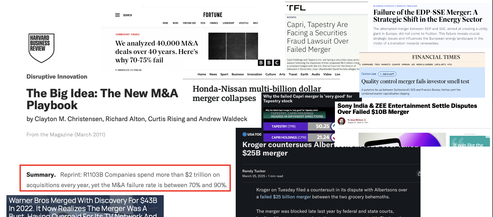
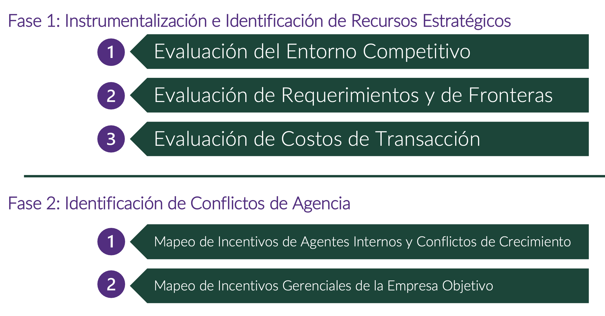
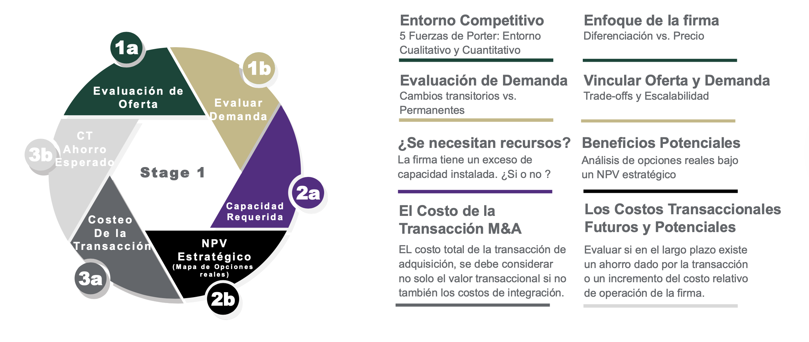
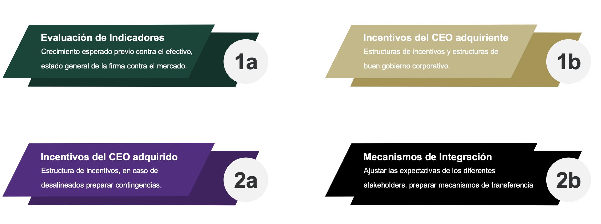

<section class="title-slide">
Semana 7 | Planificación de la estrategia de inversión

Ingeniería Financiera y Administración de Riesgos Financieros • <em>Noviembre 18, 2025</em>

</section>

---

## Agenda
1. Sobre la Semana Anterior
2. Contenido Semana 7

---

## Sobre la Semana Anterior
Riesgo Mercado (Cont.)

- **6.1 Medición de la exposición cambiaria**
- **6.2 Paridad cubierta y precios a término**
- **6.3 Coberturas**
- **6.4 Oeprativa, riesgos y contabilidad**

---

## Contenido Semana 7
Planificación de la estrategia de inversión

- **7.1** Estrategias de Momentum
- **7.2** Estrategias de valor
- **7.3** Opciones reales
- **7.4** Estructura Óptima de Capital
- **7.5** Fusiones y Adquisiciones Estratégicas

---

## 7.1 Estrategias de Momentum

--

## 7.1.1 Momentum — ¿Qué es y por qué existe?
- **Momentum**: regularidad empírica donde ganadores recientes tienden a seguir ganando y perdedores a seguir perdiendo en el corto/mediano plazo.
- **Horizontes típicos**: 3–12 meses; se observa en varias clases de activos y regiones.

--

- **Posibles causas**: 
  - Riesgo sistemático (factores no diversificables correlacionados con “ganadores”).
  - Ineficiencias conductuales (sobre/infra-reacción, extrapolación, atención limitada).
- **Tesis operativa**: el ranking por desempeño reciente contiene señal predictiva explotable antes de costos.

--

## 7.1.2 Momentum — Medida canónica 12–2 (“skip month”)
- **Cálculo básico**: retorno acumulado de $t-12$ a $t-2$ **excluyendo** $t-1$ para evitar reversión de muy corto plazo.

--

**Precio**  

$$Momentum_{i,t}=\frac{P_{i,t-2}}{P_{i,t-12}}-1$$

--

**Retornos**  

$$Mom_{i,t}=\prod_{m=t-12}^{t-2}\!\big(1+r_{i,m}\big)-1$$

- **Razonamiento**: excluir $t-1$ reduce ruido de microestructura y micro-reversiones.

--

## 7.1.3 Momentum — Cartera long–short por ranking
- **Definición de “long–short”**: posición **larga** en ganadores y **corta** en perdedores, construida tras ordenar por $\text{Moment}_{i,t}$.
- **Implementación típica**: deciles (Q1 perdedores, Q10 ganadores), rebalanceo mensual.

--

- **Rendimiento de la estrategia**:
  $$
  R_{LS,t} = \frac{1}{N_W}\sum_{i\in W} R_{i,t} - \frac{1}{N_L}\sum_{j\in L} R_{j,t}
  $$
- **Pesos por riesgo** (opcional): escalar cada pata por su volatilidad ex–ante para equilibrar contribuciones al riesgo.

--

## 7.1.4 Momentum — Neutralización y ejecución global
- **Neutralización sectorial**: formar ganadores/perdedores **intra–industria** para evitar apuestas sectoriales indeseadas.
- **Agregación por región/país**: reducir concentración y dependencias de un único mercado.

--

- **Rebalanceo mensual disciplinado**: mantener exposición al factor “puro”.
- **Filtros previos**: excluir activos con baja **liquidez** (definida previamente) o altos costos de transacción.

--

## 7.1.5 Momentum — Riesgos y control cuantitativo
- **Riesgo clave**: **puntos de giro** (reversiones bruscas) que pueden generar pérdidas rápidas.
- **Escalamiento por volatilidad (volatility targeting)**:
  - Definición previa: **volatilidad objetivo** $\sigma^\ast$.

--

  - Factor de escala y pesos:

$$
s_t = \frac{\sigma^\ast}{\hat{\sigma}_t}
$$

$$
w_{i,t}^{\mathrm{scaled}} = s_t\, w_{i,t}
$$

--

- **Límites de exposición**: por activo/sector/región.
- **Reglas de salida**: disparadores ante señales robustas de reversión (por ejemplo, quiebres de tendencia confirmados).

--

## 7.1.6 Momentum — Timing con promedio móvil de 10 meses

- **MA10**: definimos $M_{10,t}$ = promedio móvil de 10 meses; $Signal_t$ = indicador (1/0);
  $R_t^{(r)}$ = retorno del activo riesgoso; $R_t^{(a)}$ = retorno de la alternativa.

--

- **Regla binaria**:

$$
Signal_t = I\{\, P_t - M_{10,t} > 0 \,\}
$$

- **Retorno de la estrategia**:

$$
R_t^{(s)} = Signal_t \, R_t^{(r)} + \big(1 - Signal_t\big)\, R_t^{(a)}
$$

--

- **Intuición**: recorta drawdowns en grandes mercados bajistas, con costo potencial de “llegar tarde” a reentradas.
- **Uso**: como overlay defensivo sobre índices amplios o patas largas de momentum.

--

## 7.1.7 Momentum — Síntesis y multifactor
- **Buenas prácticas**: 12–2 “skip month”, neutralización sectorial, rebalanceo mensual, **volatility targeting**, filtros de liquidez.
- **Combinación multifactor**: emparejar con **valor** (definido más adelante) y **calidad** para diversificar fuentes de retorno.

--

- **Objetivo**: suavizar trayectoria de retornos y mejorar métricas como el **ratio de información** (definido previamente como exceso de retorno activo dividido por tracking error).

---

## 7.2 Estrategias de valor

--

## 7.2.1 Valor — Filosofía y objetivo
- **Valor intrínseco**: precio teórico sustentado por fundamentos económicos y financieros.
- **Tesis**: comprar con **descuento** frente al valor intrínseco y capturar convergencia precio–valor.
- **“Alfa”**: retorno anormal tras ajustar por riesgos sistemáticos; meta de la selección en valor.
- **Riesgos**: “trampas de valor” (barato por razones estructurales), gobierno corporativo débil, balances frágiles.

--

## 7.2.2 Valor — Múltiplos y DCF
- **Múltiplos**: anclar un **múltiplo objetivo** a una métrica esperada.
  - Ejemplos: 
    - **P/E** (precio/utilidad)
    - **P/B** (precio/valor libro)
    - **EV/EBITDA** (valor empresa/EBITDA) cada sigla se define en su primera mención.

--
  
  - Fórmula genérica:
    $$
    \text{Valor} = \text{Métrica Esperada} \times \text{Múltiplo Objetivo}
    $$

--

- **DCF** (Descuento de Flujos de Caja): 
  $$
  \text{VAN} = \sum_{t=1}^{T}\frac{FCF_t}{(1+WACC)^t} + \frac{TV}{(1+WACC)^T} - \text{Inversión Inicial}
  $$
  - **VAN**: Valor Actual Neto (también VPN).
  - **WACC**: Costo Promedio Ponderado de Capital (definido aquí antes de usar).
  - **TV**: Valor Terminal; **FCF**: Flujo de Caja Libre.

--

## 7.2.3 Valor — Identificación de "gangas" y comparables
- **Screening inicial**: múltiplos bajos **ajustados por calidad** (rentabilidad sostenible, estabilidad de márgenes) y ciclo.
- **Comparables intra–industria**: controlar diferencias en crecimiento, estructura de capital y riesgo.

--

- **Gobernanza**: priorizar juntas y estructuras de incentivos que protejan minoritarios.
- **Liquidez**: confirmar capacidad de implementar y deshacer posiciones sin costos excesivos.

--

## 7.2.4 Valor — Margen de seguridad y catalizadores
- **Margen de seguridad (MOS)**:
  - Ejemplo: si $EPS = 5$ (utilidad por acción) y $P/E_{\text{objetivo}} = 15$, entonces **valor objetivo** $= 75$.
  - Si precio de mercado $= 50$:
    $$
    \text{MOS} = 1 - \frac{\text{Precio}}{\text{Valor}} = 1 - \frac{50}{75} = 33.3\%
    $$

--

- **Catalizadores**: mejora de márgenes, desalavancamiento, rotación sectorial, cambios regulatorios favorables.
- **Disciplina de venta**: convergencia a valor, deterioro de fundamentales, mejor alternativa interna.

--

## 7.2.5 Valor — Integración con otros factores
- **Con calidad**: filtrar trampas de valor con métricas de rentabilidad (ROIC, márgenes).
- **Con momentum**: evitar persistencia de infravaloración; priorizar valores con señal de precio favorable.

--

- **Concentración**: límites por emisor/industria/país; evaluar correlaciones para no apilar riesgos.
- **Objetivo**: mejorar el perfil **riesgo–retorno** (por ejemplo, elevar el **ratio de información**).

---

## 7.3 Opciones reales

--

## 7.3.1 Opciones Reales — Motivación
- **Limitación del DCF**: valora rutas fijas y no reconoce **flexibilidad gerencial** (derechos de esperar, expandir, contraer, abandonar).
- **Opción real**: derecho (no obligación) sobre decisiones del proyecto; análogo a una opción financiera.

--

- **Valor bajo incertidumbre**: mayor volatilidad y capacidad de decisión aumentan el valor de esperar.
- **Meta**: comparar **proyecto con flexibilidad** vs. **proyecto sin flexibilidad**.

--

## 7.3.2 Opciones Reales — Condiciones de valor
- **Tres condiciones**:
  1) **Incertidumbre** futura relevante.
  2) **Decisión adaptativa** disponible para la gerencia.
  3) **Payoff no lineal** que preserve el upside y limite downside.

--

- **Interpretación**: aún con $\text{VAN}\approx 0$, puede convenir **posponer** si la información futura mejora la decisión.
- **Caso típico**: industrias con ciclos largos, disrupción tecnológica y marcos regulatorios cambiantes.

--

## 7.3.3 Opciones Reales — Analogía con opciones financieras
- **Mapeo**: 
  - $S$: valor del proyecto sin flexibilidad.
  - $K$: costo de invertir/expandir (precio de ejercicio).
  - $\sigma$: volatilidad del valor del proyecto.
  - $r$: tasa libre de riesgo; $T$: horizonte de decisión.

--

- **Árbol binomial**: $S \to (uS, dS)$ con $u>1>d$.
- **Probabilidad neutral al riesgo**:
  $$
  p^\ast = \frac{(1+r) - d}{u - d}
  $$

--

**Retropropagacion**  

$$V_{op,t}=\max\!\left(\frac{p\,V_{op,t+1}^{up}+(1-p)\,V_{op,t+1}^{down}}{1+r},\;X_t\right)$$

--

## 7.3.4 Opciones Reales — Opción de esperar (ejemplo)
- **Comparación hoy**: invertir ahora vs. mantener opción de decidir tras observar nueva información.
**Valor en t=0**

$$
C_0 = \frac{p\,\max(S_u-K,0) + (1-p)\,\max(S_d-K,0)}{1+r}
$$

$$
V_0 = \max\{\, S_0 - K \;,\; C_0 \,\}
$$

--

- **Intuición**: con $\sigma$ alta (rango amplio entre $u$ y $d$), esperar suele dominar porque preserva el upside y limita pérdidas.
- **Regla**: ejercer cuando el valor intrínseco supera el valor esperado de continuar.

--

## 7.3.5 Opciones Reales — Expandir, contraer, abandonar, switch
- **Expandir (call)**: ejercer si el valor incremental supera el costo de expansión.
- **Contraer (put parcial)**: reducir escala para mejorar perfil riesgo–retorno.

--

- **Abandonar (put con rescate $A$)**:
$V_{t} = \max\left\{ A,\ \frac{p^\ast V_{t+1}^{\text{up}} + (1-p^\ast) V_{t+1}^{\text{down}}}{1+r} \right\}$
- **Switch**: cambiar tecnología o insumos; modelar como opción compuesta con payoff dependiente del costo de transición.

--

## 7.3.6 Opciones Reales — Checklist y comparación con DCF
- **Paso 1**: estimar **VAN (DCF)** realista sin flexibilidad.
- **Paso 2**: identificar **fuentes de flexibilidad** y parametrizar $(S,K,\sigma,r,T)$.
- **Paso 3**: valorar vía **binomial** o fórmulas cerradas (si aplican), alternativa multiples flujos con sensibilidades y precios de ejecución especificos.

--

- **Paso 4**: comparar **con vs. sin** opción real.
- **Decisión**: invertir ya, rediseñar, **esperar** o abandonar según valor económico y restricciones operativas.

---

## 7.4 Estructura Óptima de Capital

--

## 7.4.1 Estructura de Capital — Costo de capital y mínimos
- **CAPM** (Capital Asset Pricing Model, definido aquí):
  $$
  r_E = R_f + \beta_E (R_M - R_f)
  $$
  - $r_E$: costo del equity; $R_f$: tasa libre de riesgo; $R_M$: rendimiento del mercado; $\beta_E$: sensibilidad del equity.

--

- **WACC** (Weighted Average Cost of Capital, definido aquí):
  $$
  \text{WACC} = \frac{E}{D+E} r_E + \frac{D}{D+E} r_D (1-\tau)
  $$
  - $r_D$: costo de la deuda; $\tau$: tasa impositiva; $D,E$: deuda y equity.
- **Criterio**: invertir si el rendimiento esperado del proyecto excede el WACC.

--

## 7.4.2 Estructura de Capital — Óptimo práctico (APV)
- **APV** (Adjusted Present Value, definido aquí):
  $$
  \text{APV} = \text{VAN}_{\text{sin deuda}} + \text{PV(Escudo Fiscal)} - \text{PV(Costos de Dificultad/Agencia)}
  $$

--

- **Trade-off**: escudo fiscal vs. costos esperados de dificultades financieras y fricciones de agencia.
- **Herramientas**: plazo y covenants de deuda, estructura de incentivos, políticas de dividendos.
- **Criterio**: minimizar WACC o maximizar APV sujeto a restricciones de resiliencia.

--

## 7.4.3 Estructura de Capital — Contexto de mercados emergentes
- **Plazos**: alinear vencimientos con vida de activos para reducir riesgo de refinanciación.
- **Moneda**: gestionar descalces (ingresos vs. deuda) para mitigar riesgo cambiario.

--

- **Amortiguadores**: liquidez y líneas comprometidas; métricas (interés/EBIT, deuda/EBITDA).
- **Decisión emisión**: comparar costo marginal de fondos y efectos de control/propiedad.

--

## 7.4.4 Estructura de Capital — Función Objetivo

<section data-background-color="transparent">
  

    

      <iframe
        src="https://miro.com/app/live-embed/uXjVJsV66RI=/?embedMode=view_only_without_ui&moveToViewport=-508,-514,1208,822&embedId=1876356640"
        style="position:absolute; inset:0; width:100%; height:100%; border:0;"
        scrolling="no"
        allow="fullscreen; clipboard-read; clipboard-write"
        allowfullscreen>
      </iframe>
    

  

</section>

---

## 7. 5 Fusiones y Adquisiciones Estratégicas

--

## 7.5.1 M&A — No son una receta mágica

<section data-background-color="transparent">
  
</section>

--

## 7.5.2 M&A — Un análisis por fases

<section data-background-color="transparent">
  
</section>

--

## 7.5.3 M&A — Fase 1

<section data-background-color="transparent">
  
</section>

--

## 7.5.4 M&A — Fase 2

<section data-background-color="transparent">
  
</section>

---

## Dudas y Preguntas